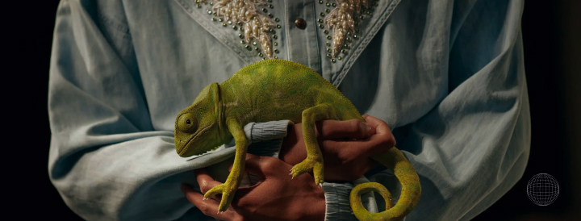

# Camille Mormal Recreation

### Recreation of the smoothest website you could ever seen [camillemormal](https://camillemormal.com/)

## [Live Demo](https://camillemormal-recreation.vercel.app/)

In this project, I focused on implementing scroll-to-bottom navigation functionality and deepening my understanding of `framer-motion` rather than using `GSAP`

### 'createdWith': {

```
    "classnames": "^2.5.1",
    "framer-motion": "^11.0.3",
    "locomotive-scroll": "^5.0.0-beta.11",
    "react": "^18.2.0",
    "react-dom": "^18.2.0",
    "react-lazy-load-image-component": "^1.6.2",
    "react-query": "^3.39.3",
    "react-router-dom": "^6.22.3",
    "sass": "^1.70.0"
```

### }

